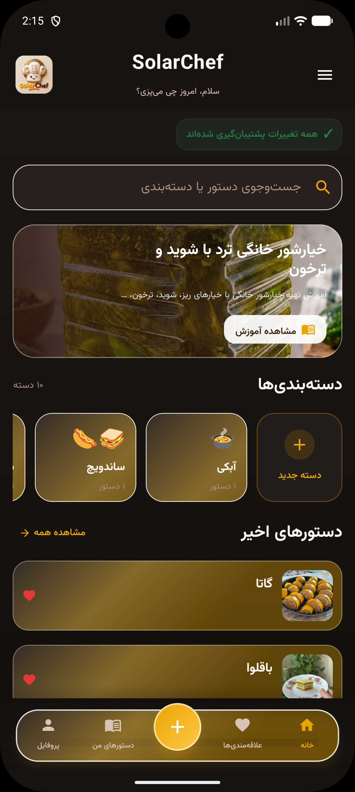
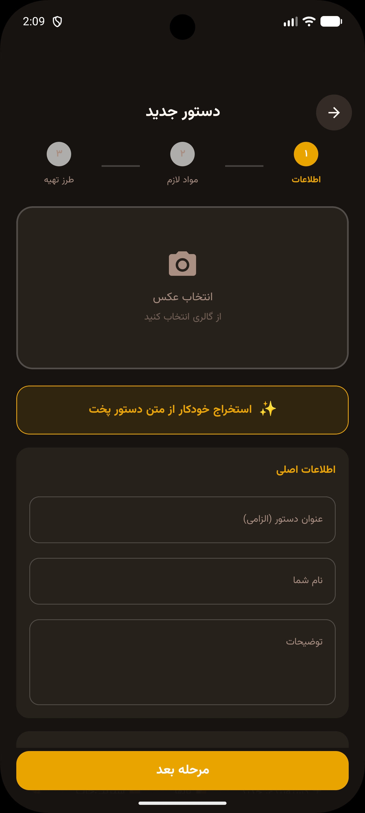

# SolarChef

An Android cooking app for saving recipes, adjusting ingredient quantities, and following recipes step by step. Built with Kotlin and Jetpack Compose, with local storage and connected services for accounts, synchronization, articles, and AI-assisted recipe extraction.

**[Available on Cafe Bazaar](https://cafebazaar.ir/app/com.mnfarzaneh.solalrchef)** · Version **1.1.1** · Android **7.0+** · Persian interface

## Features

- Create and edit recipes with photos, ingredients, equipment, and cooking steps.
- Scale ingredients by servings or by the amount of an ingredient available.
- Preserve qualitative amounts such as “a little” and “as needed,” alongside numeric quantities and ranges.
- Organize recipes with custom categories and favorites.
- Follow instructions in a dedicated cooking view.
- Extract recipes from text, review the result, and save them.
- Sign in to back up and synchronize personal recipe data.
- Read structured cooking articles and share links that open on the web.
- Choose accent colors and light or dark mode.

Saved recipes and the ingredient calculator work locally. Account operations, synchronization, article downloads, and AI extraction require network access.

## Android architecture

Compose screens observe ViewModel state through StateFlow. Repositories coordinate Room storage and remote API calls. Hilt supplies dependencies, and WorkManager handles background synchronization and article checks.

| Area | Technologies |
| --- | --- |
| UI | Jetpack Compose, Material 3, Navigation Compose, Coil |
| State and asynchronous work | ViewModel, StateFlow, Kotlin Coroutines |
| Dependency injection | Hilt |
| Local data | Room, DAOs, explicit database migrations |
| Networking | Retrofit, OkHttp, Gson |
| Background work | WorkManager |
| Release build | Gradle, R8, environment-based signing configuration |

Firebase dependencies and integration code remain in the project, so a local Firebase configuration is required to build it.

## Connected services

This repository contains the Android application. The wider SolarChef product includes separately maintained services:

- **Kotlin / Ktor and PostgreSQL:** accounts, recipe data, categories, and articles.
- **ArvanCloud object storage:** recipe and article images accessed through signed URLs.
- **Python / Flask and Gemini:** extraction of structured recipe data from text, followed by review in the app.
- **Web article pages and an admin panel:** article publishing, recipe inspection, and storage management.

Article notifications use WorkManager checks scheduled at a 24-hour interval. Delivery depends on Android background scheduling and notification permission; this is not immediate server push.

## Build locally

1. Clone the repository and open it in Android Studio.
2. Install Android SDK 36 and configure its path through Android Studio or `local.properties`.
3. Use JDK 21 to run Gradle. The app's JVM compilation target is 11.
4. Add your own Firebase `google-services.json` to `app/`, configured for package `com.mnfarzaneh.solalrchef`. This file is excluded from Git.
5. Review the API URLs in `NetworkModule.kt`. They currently point to deployed SolarChef services; configure your own endpoints for development against a separate backend.

From PowerShell at the project root:

```powershell
.\gradlew.bat :app:assembleDebug
```

Backend services are not provisioned by this repository. Gemini credentials belong on the extraction server, not in the Android client.

### Release signing

The release signing configuration uses four environment variables:

```text
SOLARCHEF_KEYSTORE_PATH
SOLARCHEF_STORE_PASSWORD
SOLARCHEF_KEY_ALIAS
SOLARCHEF_KEY_PASSWORD
```

All four must be present to enable the configured signing. Keep the keystore and passwords private.

```powershell
.\gradlew.bat :app:assembleRelease :app:bundleRelease
```

## Release history

See [CHANGELOG.md](CHANGELOG.md).

Version 1.1.1 corrects a Room migration for users upgrading directly from an earlier published database schema. Existing recipe data is copied into the current schema rather than discarded.

## Testing and next steps

Automated coverage is limited. Test dependencies and test sources are present, but the extraction ViewModel test file is currently commented out. Expanding migration tests, ingredient-calculation tests, and CI verification is planned work.

## Screenshots

SolarChef 1.1.1 in Persian, with the dark and gold theme: browse recipes and categories, view recipe details, and add a recipe with AI-assisted text extraction.

| Home and categories | Recipe details | Add a recipe |
| :---: | :---: | :---: |
|  |  |  |

## Author

**Zahra Mirzaalian** — creator and developer of SolarChef.

[GitHub](https://github.com/mnfarzaneh)
