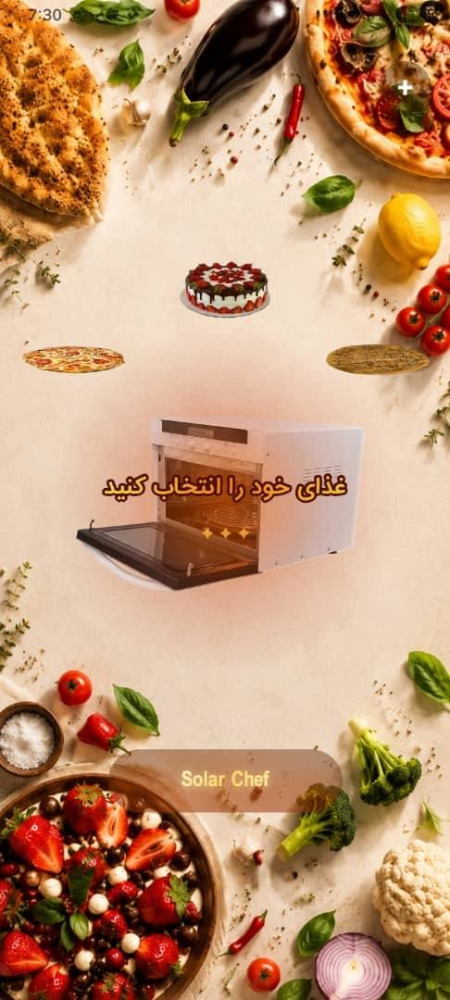
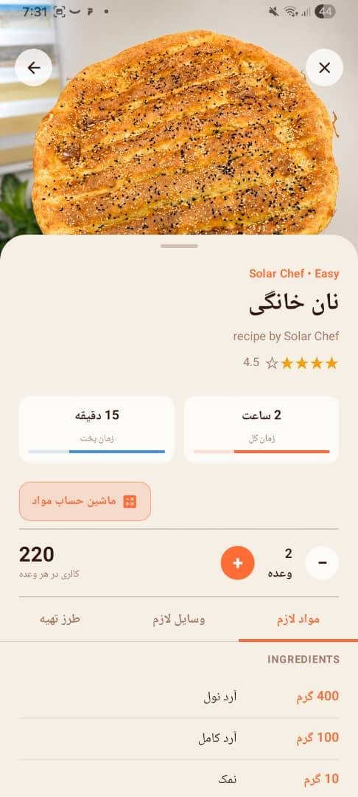

# Solar Chef 🍳

Solar Chef is a modern Android recipe application built with **Kotlin** and **Jetpack Compose**.

The application allows users to browse recipes, create their own recipes, edit existing recipes, and store them locally on the device. One of the key features of Solar Chef is its smart ingredient scaling system, which helps users adapt recipes to the ingredients they already have at home.

### Home Screen

### cooking Screen

---

## Features

- Create custom recipes
- Edit existing recipes
- Store recipes locally using **Room Database**
- Add recipe images from the device gallery
- Ingredient management
- Equipment management
- Step-by-step cooking instructions
- Dynamic recipe scaling
- Serving size adjustment
- Ingredient quantity recalculation based on servings
- Modern UI built entirely with **Jetpack Compose**
- Offline-first experience

---

## Smart Ingredient Calculator

Solar Chef includes a built-in ingredient calculator that automatically recalculates ingredient quantities when the serving size changes.

In addition, users can enter the amount of ingredients they currently have available and estimate how many servings of a recipe they can prepare. This makes recipe scaling practical and helps reduce ingredient waste.

---

## Tech Stack

- **Kotlin**
- **Jetpack Compose**
- **MVVM Architecture**
- **Hilt Dependency Injection**
- **Room Database**
- **StateFlow**
- **Navigation Compose**
- **Coil**

---

## Architecture

The project follows the **MVVM (Model–View–ViewModel)** architecture pattern.

- **Jetpack Compose** is used for building the UI.
- **ViewModels** manage screen state using **StateFlow**.
- **Repositories** handle data operations.
- **Room Database** provides local persistence.
- **Hilt** manages dependency injection throughout the application.

---

## State Management

**StateFlow** is used as the primary state management solution across the application.

Examples include:

- Add Recipe form state
- Recipe Details screen state
- Loading states
- Serving size adjustments
- Cooking step completion tracking
- Ingredient calculator updates

---

## Screens

- Recipe List
- Recipe Details
- Add Recipe
- Edit Recipe
- Ingredient Calculator

---

## Author

**Zahra Mirzaalian**

Android Developer
